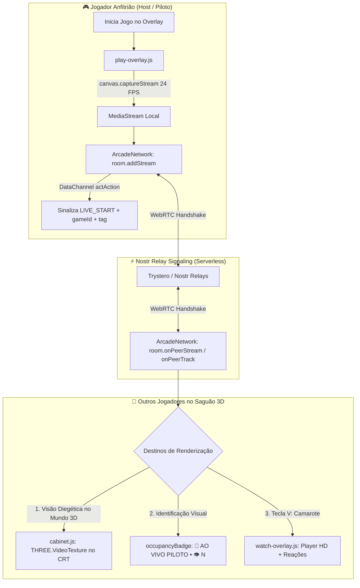

# 🕹️ Plano de Implementação: Modo Espectador / Watch Party P2P no Nopex Arcade 3D

> **Status:** Em Planejamento / Proposta Técnica  
> **Arquitetura:** WebRTC P2P Descentralizado (Trystero + Nostr Relay Signaling)  
> **Escopo:** Transmissão de gameplay ao vivo, espelhamento diegético na tela CRT do gabinete 3D, letreiro holográfico `🔴 AO VIVO` e modo camarote (tecla <kbd>V</kbd>).

---

## 1. Visão Geral e Motivação

No fliperama tradicional dos anos 80 e 90, a experiência social não se resumia a sentar e jogar: grande parte da diversão vinha de **se aglomerar ao redor do gabinete para ver alguém jogando uma partida incrível**, torcer, comemorar e esperar a sua ficha.

O **Modo Espectador / Watch Party P2P** traduz essa vivência para o ambiente 3D do Nopex Arcade Multiplayer:
1. **Transmissão Serverless:** Quando um jogador ocupa um gabinete e inicia a partida, o canvas do jogo é capturado nativamente a 24 FPS e transmitido via WebRTC diretamente aos outros avatares conectados na sala.
2. **Espelhamento Diegético no Gabinete:** Qualquer jogador andando pelo saguão 3D enxerga a tela CRT do gabinete reproduzindo o gameplay do jogador em tempo real (via `THREE.VideoTexture`), junto com uma luz de marquee pulsante `🔴 AO VIVO [TAG]`.
3. **Modo Camarote (<kbd>V</kbd>):** Ao se aproximar de um gabinete ocupado, o prompt contextual exibe `<kbd>V</kbd> Assistir Partida`. Ao pressionar a tecla, o jogador abre um overlay de transmissão em alta fidelidade com reações rápidas (`🔥`, `💥`, `👏`, `😱`) e contador de espectadores.

---

## 2. Diagrama de Arquitetura de Dados & Vídeo



---

## 3. Especificação Técnica dos Componentes

### Componente 1: Captura de Stream e Ciclo de Vida (`play-overlay.js`)
- **Mecanismo de Captura:**
  - Extração do elemento `<canvas>` dentro do `iframe` do jogo carregado via `iframe.contentDocument.querySelector('canvas')`.
  - Execução de `canvas.captureStream(24)` para obter um `MediaStream` leve (24 FPS, otimizado para retro-pixel e largura de banda P2P reduzida ~350-500 kbps).
  - Polling seguro de até 6 segundos durante a inicialização do jogo/emulador para capturar o canvas no instante exato de renderização inicial.
- **Resiliência e Segurança:**
  - Captura 100% garantida para os 10 jogos clássicos em `/games/` e jogos first-party sob o mesmo domínio.
  - Se um iframe de terceiros restringir o canvas via CORS (*tainted canvas*), o sistema falha silenciosamente mantendo a ocupação normal e o attract loop.
- **Limpeza:**
  - Ao fechar o overlay (<kbd>ESC</kbd>), todos os `MediaStreamTrack` são parados imediatamente (`track.stop()`) para liberar a CPU/GPU e notificar a rede.

### Componente 2: Sinalização e Transmissão WebRTC P2P (`network.js`)
- **Uso das APIs nativas do Trystero:**
  - `this.room.addStream(stream, targetPeerId, metadata)`: Envia o stream de vídeo diretamente aos pares conectados.
  - `this.room.removeStream(stream, targetPeerId)`: Encerra o fluxo quando a partida termina.
  - `this.room.onPeerStream((stream, peerId, metadata) => ...)` e `this.room.onPeerTrack`: Recebe faixas de vídeo de peers remotos.
  - Emissão de mensagem DataChannel `actAction`:
    ```json
    { "type": "LIVE_START", "gameId": "metal-slug", "pilotTag": "MARCUS" }
    { "type": "LIVE_STOP", "gameId": "metal-slug" }
    ```
- **Novos Entrantes:**
  - No evento `onPeerJoin(peerId)`, se o jogador local estiver transmitindo, o stream é automaticamente registrado para o novo peer que acabou de entrar no saguão.

### Componente 3: Tela CRT Diegética e Badge 3D (`cabinet.js`)
- **Substituição da Textura CRT:**
  - A tela do gabinete possui originalmente uma textura canvas 256x224 com scanlines (`drawCRTAttract`).
  - Ao receber um stream ao vivo:
    1. Cria/reutiliza um elemento HTML5 `<video>` oculto em memória com `autoplay = true`, `muted = true`, `playsInline = true`.
    2. Atribui `video.srcObject = mediaStream`.
    3. Substitui o material da tela por `new THREE.VideoTexture(video)` com filtros pixelados `THREE.NearestFilter`.
  - Ao encerrar a transmissão:
    1. Restaura imediatamente o `THREE.CanvasTexture` com o attract loop original.
- **Badge Holográfico 3D:**
  - O sprite flutuante sobre o marquee altera seu visual:
    - **Normal:** Nome do Gabinete + Categoria.
    - **Ocupado:** `🟡 JOGANDO: [TAG]`.
    - **Transmitindo Ao Vivo:** `🔴 AO VIVO: [TAG] • 👁️ [ESPECTADORES]` com pulsação de luz vermelha e amarela.

### Componente 4: Modo Camarote em Tela Cheia / PIP (`watch-overlay.js`)
- **Interface do Espectador:**
  - Container modal `#arcade-watch-overlay` com moldura retrô arcade.
  - Elemento `<video>` em escala responsiva mantendo aspecto original (4:3 ou 16:9).
  - Barra de status no topo: Indicador `🔴 AO VIVO`, Nome do Jogo, Piloto Atual e Duração da Partida.
  - Barra de interações rápidas: Botões para enviar reações de torcida pelo chat P2P (`🔥 GG!`, `💥 BOA!`, `👏 MANDOU BEM!`, `😱 PERIGO!`).
  - Tecla de saída rápida: <kbd>ESC</kbd> ou <kbd>V</kbd> fecha o modo camarote instantaneamente sem interromper a navegação no saguão 3D.

### Componente 5: Interação e HUD no Saguão (`interaction.js`, `index.html`, `style.css`)
- **Proximidade:**
  - Ao aproximar o avatar de um gabinete com transmissão ao vivo:
    - O card de contexto inferior exibe: `<kbd class="kbd-neon">V</kbd> ASSISTIR PARTIDA DE [TAG]`.
  - A tecla <kbd>V</kbd> é capturada no loop de eventos do motor 3D.
- **Dock de Comandos:**
  - O rodapé do saguão ganha o atalho fixo `<kbd>V</kbd> Assistir` ao lado de `<kbd>E</kbd> Jogar`, `<kbd>J</kbd> Jukebox` e `<kbd>T</kbd> Chat`.

---

## 4. Plano de Execução em Fases

| Fase | Descrição | Arquivos Modificados / Criados |
|---|---|---|
| **Fase 1** | Captura do Canvas e Gestão de Ciclo de Vida | `src/arcade3d/play-overlay.js` |
| **Fase 2** | Integração WebRTC P2P de Streams no Trystero | `src/arcade3d/network.js` |
| **Fase 3** | Textura de Vídeo Diegética e Badges 3D | `src/arcade3d/cabinet.js` |
| **Fase 4** | Modal e HUD de Espectador (Camarote) | `src/arcade3d/watch-overlay.js` (novo) |
| **Fase 5** | Interação de Proximidade e Atalho <kbd>V</kbd> | `src/arcade3d/interaction.js`, `src/arcade3d/engine.js` |
| **Fase 6** | Estilização, HUD Dock e Dock Keycaps | `index.html`, `src/style.css` |
| **Fase 7** | Validação com 2 instâncias locais, Build Vite e Deploy | Build `dist/`, branch `master` e `gh-pages` |

---

## 5. Critérios de Sucesso e Validação

1. **Desempenho Estável:** O motor 3D mantém 60 FPS no saguão mesmo com texturas de vídeo ativas nos gabinetes.
2. **Zero Servidores Dedicados:** Todo o streaming ocorre 100% P2P cliente-a-cliente via WebRTC sem custos de backend de streaming.
3. **Experiência Suave:** A transição entre caminhar pelo salão, ver a tela do gabinete se mover à distância e abrir o camarote em tela cheia com a tecla <kbd>V</kbd> ocorre em menos de 300ms.
4. **Isolamento de Erros:** Fechar o jogo com <kbd>ESC</kbd> encerra os tracks de mídia imediatamente sem vazamentos de memória ou conexões órfãs.
